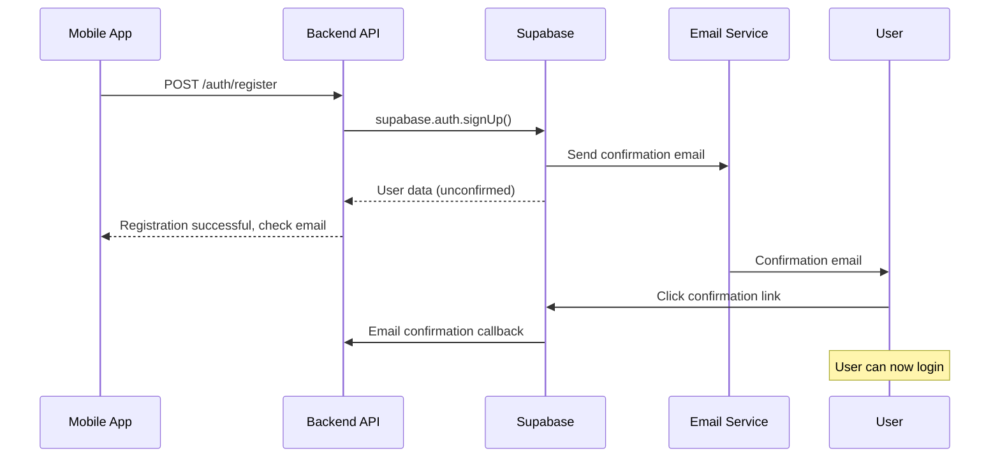
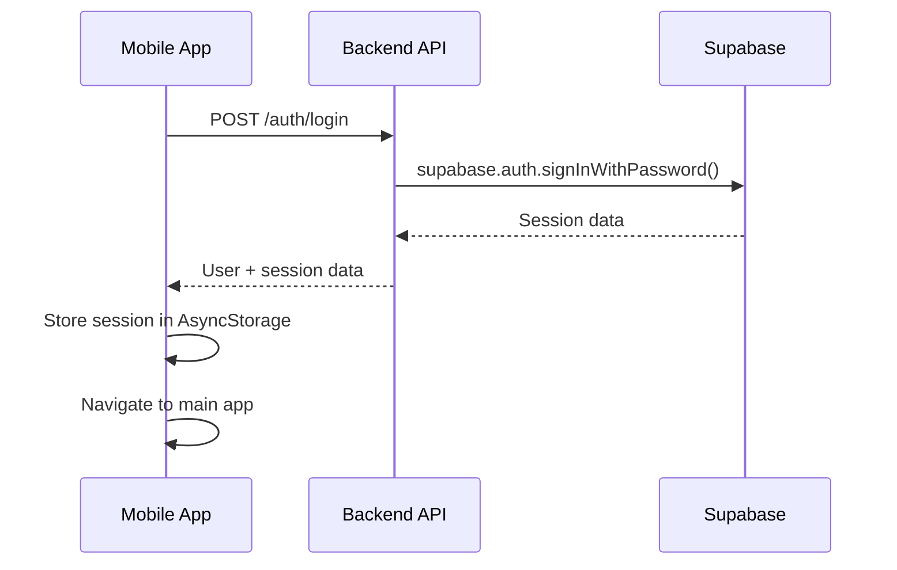
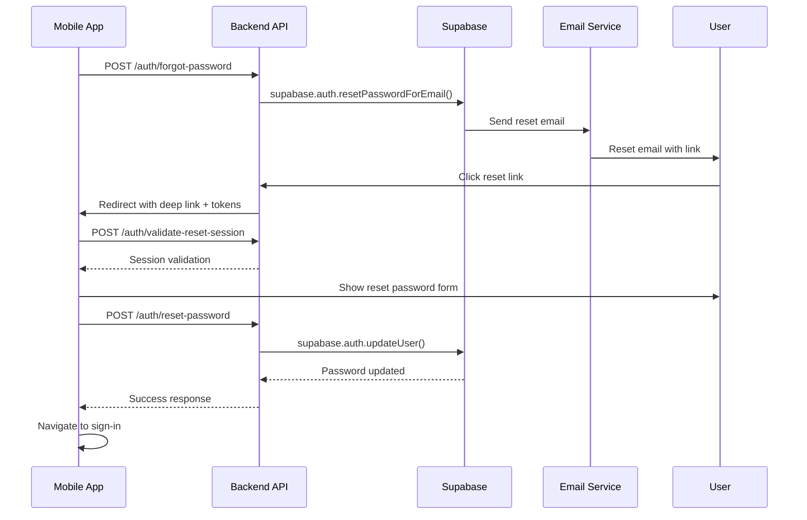

# Expense Tracker Authentication System

## Overview

The Expense Tracker implements a comprehensive authentication system using Supabase as the authentication provider. The architecture consists of a Node.js backend API that handles all Supabase interactions, and a React Native mobile app that communicates exclusively through the backend API.

## 🏗️ System Architecture

```
┌─────────────────┐    ┌─────────────────┐    ┌─────────────────┐
│   Mobile App    │    │   Backend API   │    │    Supabase     │
│  (React Native) │◄──►│   (Node.js)     │◄──►│   (Auth Provider)│
└─────────────────┘    └─────────────────┘    └─────────────────┘
```

### Key Design Principles

1. **Backend-Only Supabase Integration**: Only the backend communicates with Supabase directly
2. **Stateless Mobile Client**: Mobile app uses the backend API for all authentication operations
3. **Secure Token Management**: JWT tokens handled securely on both ends
4. **Deep Linking Support**: Password reset flows support deep linking back to the mobile app

## 🔧 Backend Implementation (`ExpenseTracker.Api.V2`)

### Project Structure

```
ExpenseTracker.Api.V2/
├── app.js                          # Main application entry point
├── src/
│   ├── config/
│   │   └── supabase.js            # Supabase client configuration
│   ├── middleware/
│   │   ├── validation.js          # Input validation middleware
│   │   └── errorHandler.js        # Error handling middleware
│   ├── services/
│   │   └── authService.js         # Authentication business logic
│   └── routes/
│       └── auth.js                # Authentication route handlers
└── package.json
```

### Core Configuration

#### Supabase Client (`src/config/supabase.js`)

```javascript
import { createClient } from "@supabase/supabase-js";

const supabaseUrl = process.env.SUPABASE_URL;
const supabaseKey = process.env.SUPABASE_ANON_KEY;

export const supabase = createClient(supabaseUrl, supabaseKey, {
  auth: {
    autoRefreshToken: false,
    persistSession: false,
    detectSessionInUrl: false,
  },
});
```

#### Express Application (`app.js`)

```javascript
import express from "express";
import cors from "cors";
import { authRouter } from "./src/routes/auth.js";
import { errorHandler } from "./src/middleware/errorHandler.js";

const app = express();
const PORT = process.env.PORT || 3000;

// Middleware
app.use(
  cors({
    origin: ["http://localhost:8081", "exp://192.168.1.100:8081"],
    credentials: true,
  })
);
app.use(express.json());

// Routes
app.use("/auth", authRouter);

// Error handling
app.use(errorHandler);

app.listen(PORT, () => {
  console.log(`Server running on port ${PORT}`);
});
```

### Authentication Endpoints

#### POST `/auth/register`

Registers a new user with email confirmation.

**Request**:

```json
{
  "email": "user@example.com",
  "password": "securePassword123"
}
```

**Response** (Success):

```json
{
  "success": true,
  "message": "Registration successful. Please check your email for confirmation.",
  "requiresConfirmation": true
}
```

#### POST `/auth/login`

Authenticates a user and returns session information.

**Request**:

```json
{
  "email": "user@example.com",
  "password": "securePassword123"
}
```

**Response** (Success):

```json
{
  "success": true,
  "message": "Login successful",
  "user": {
    "id": "uuid",
    "email": "user@example.com",
    "email_confirmed_at": "2024-01-01T00:00:00Z"
  },
  "session": {
    "access_token": "jwt_token",
    "refresh_token": "refresh_token",
    "expires_at": 1234567890
  }
}
```

#### POST `/auth/forgot-password`

Initiates password reset flow.

**Request**:

```json
{
  "email": "user@example.com"
}
```

**Response** (Success):

```json
{
  "success": true,
  "message": "Password reset email sent successfully"
}
```

#### GET `/auth/callback/reset-password`

Handles password reset callbacks from Supabase.

**Query Parameters**:

- `access_token`: JWT access token
- `refresh_token`: Refresh token
- `type`: Should be "recovery"

**Response**: Redirects to mobile app with deep link:

```
expense-tracker://auth/reset-password?access_token=...&refresh_token=...
```

#### POST `/auth/reset-password`

Completes password reset process.

**Request**:

```json
{
  "newPassword": "newSecurePassword123"
}
```

**Headers**:

```
Authorization: Bearer <access_token>
```

**Response** (Success):

```json
{
  "success": true,
  "message": "Password updated successfully"
}
```

#### POST `/auth/validate-reset-session`

Validates reset session tokens.

**Request**:

```json
{
  "accessToken": "jwt_token",
  "refreshToken": "refresh_token"
}
```

**Response** (Success):

```json
{
  "success": true,
  "valid": true,
  "user": {
    "id": "uuid",
    "email": "user@example.com"
  }
}
```

### Middleware Components

#### Validation Middleware (`src/middleware/validation.js`)

```javascript
import { body, validationResult } from "express-validator";

export const validateEmail = [
  body("email")
    .isEmail()
    .normalizeEmail()
    .withMessage("Please provide a valid email address"),
  checkValidationErrors,
];

export const validatePassword = [
  body("password")
    .isLength({ min: 8 })
    .withMessage("Password must be at least 8 characters long"),
  checkValidationErrors,
];
```

#### Error Handler (`src/middleware/errorHandler.js`)

```javascript
export const errorHandler = (err, req, res, next) => {
  console.error("Error:", err);

  if (err.type === "validation") {
    return res.status(400).json({
      success: false,
      error: "Validation failed",
      details: err.errors,
    });
  }

  // Default error response
  res.status(500).json({
    success: false,
    error: "Internal server error",
  });
};
```

### Authentication Service (`src/services/authService.js`)

Handles business logic for authentication operations:

```javascript
import { supabase } from "../config/supabase.js";

export class AuthService {
  async registerUser(email, password) {
    const { data, error } = await supabase.auth.signUp({
      email,
      password,
      options: {
        emailRedirectTo: `${process.env.API_URL}/auth/callback/email-confirmation`,
      },
    });

    if (error) throw error;
    return data;
  }

  async loginUser(email, password) {
    const { data, error } = await supabase.auth.signInWithPassword({
      email,
      password,
    });

    if (error) throw error;
    return data;
  }

  async initiatePasswordReset(email) {
    const { error } = await supabase.auth.resetPasswordForEmail(email, {
      redirectTo: `${process.env.API_URL}/auth/callback/reset-password`,
    });

    if (error) throw error;
  }

  async updatePassword(accessToken, newPassword) {
    await supabase.auth.setSession({
      access_token: accessToken,
      refresh_token: null,
    });

    const { error } = await supabase.auth.updateUser({
      password: newPassword,
    });

    if (error) throw error;
  }
}
```

## 📱 Mobile Implementation

For detailed mobile implementation, see [MOBILE_AUTHENTICATION.md](./MOBILE_AUTHENTICATION.md).

### Key Mobile Features

- **Custom Hooks**: `useLogin`, `useRegister`, `useForgotPassword`, `useResetPassword`
- **Error Boundaries**: Graceful error handling with fallback UI
- **Form Validation**: Real-time validation with user-friendly messages
- **Deep Linking**: Seamless password reset flow
- **Session Management**: Persistent sessions with AsyncStorage
- **Loading States**: Global loading state management

## 🔐 Authentication Flows

### Registration Flow



### Login Flow



### Password Reset Flow



## 🛡️ Security Implementation

### Token Management

1. **JWT Tokens**: Supabase-generated JWT tokens for authentication
2. **Secure Storage**: Mobile app stores tokens in AsyncStorage
3. **Automatic Expiration**: Tokens have built-in expiration handling
4. **Session Validation**: Backend validates sessions before protected operations

### Password Security

1. **Minimum Requirements**: 8+ characters enforced
2. **Supabase Handling**: Supabase manages password hashing and validation
3. **Reset Flow**: Secure email-based reset with token validation

### CORS Configuration

```javascript
app.use(
  cors({
    origin: [
      "http://localhost:8081", // Expo dev server
      "exp://192.168.1.100:8081", // Local network access
    ],
    credentials: true,
  })
);
```

### Input Validation

- **Email Validation**: Format and normalization
- **Password Validation**: Length and complexity requirements
- **Request Sanitization**: Express-validator middleware
- **Error Handling**: Sanitized error messages to prevent information leakage

## 🔧 Environment Configuration

### Backend Environment Variables

```env
# Required
SUPABASE_URL=https://your-project.supabase.co
SUPABASE_ANON_KEY=your-anon-key
API_URL=http://localhost:3000

# Optional
PORT=3000
NODE_ENV=development
```

### Mobile Environment Variables

```env
# Required
EXPO_PUBLIC_API_URL=http://localhost:3000

# Optional
EXPO_PUBLIC_ENVIRONMENT=development
```

### Supabase Configuration

#### Site URL Configuration

In Supabase Dashboard → Authentication → URL Configuration:

- **Site URL**: `http://localhost:3000` (for local development)
- **Redirect URLs**:
  - `http://localhost:3000/auth/callback/reset-password`
  - `expense-tracker://auth/reset-password`

#### Email Templates

Custom email templates for:

- **Email Confirmation**: Welcome message with confirmation link
- **Password Reset**: Password reset instructions with secure link

## 🧪 Testing

### Backend Testing

```bash
# Test registration
curl -X POST http://localhost:3000/auth/register \
  -H "Content-Type: application/json" \
  -d '{"email":"test@example.com","password":"testpass123"}'

# Test login
curl -X POST http://localhost:3000/auth/login \
  -H "Content-Type: application/json" \
  -d '{"email":"test@example.com","password":"testpass123"}'

# Test password reset
curl -X POST http://localhost:3000/auth/forgot-password \
  -H "Content-Type: application/json" \
  -d '{"email":"test@example.com"}'
```

### Mobile Testing

1. **Manual Testing**: Test each authentication flow in Expo Go
2. **Unit Testing**: Test hooks, utilities, and validation functions
3. **Integration Testing**: Test API communication and error handling
4. **E2E Testing**: Test complete user flows including deep linking

## 🚀 Deployment Considerations

### Backend Deployment

1. **Environment Variables**: Ensure all required env vars are set
2. **CORS Configuration**: Update allowed origins for production
3. **HTTPS**: Ensure SSL/TLS for production API
4. **Supabase URLs**: Update Site URL and Redirect URLs in Supabase dashboard

### Mobile Deployment

1. **API URLs**: Update `EXPO_PUBLIC_API_URL` for production
2. **Deep Link Schemes**: Configure production deep link schemes
3. **App Store**: Configure associated domains for universal links

## 📊 Performance Considerations

### Backend Performance

- **Connection Pooling**: Efficient Supabase client configuration
- **Middleware Optimization**: Minimal middleware stack
- **Error Handling**: Fast error responses without leaking information

### Mobile Performance

- **Session Caching**: Efficient AsyncStorage usage
- **Component Optimization**: Memoized validation and hooks
- **Bundle Size**: Tree-shaking and lazy loading

## 🐛 Troubleshooting

### Common Issues

1. **CORS Errors**: Check backend CORS configuration and mobile API URL
2. **Deep Link Issues**: Verify Supabase redirect URLs and mobile scheme registration
3. **Token Expiration**: Implement proper token refresh logic
4. **Email Delivery**: Check Supabase email settings and spam folders

### Debug Tools

1. **Backend Logging**: Enhanced error logging with request context
2. **Mobile Debugging**: React Native Debugger and Flipper integration
3. **Network Monitoring**: Inspect API requests and responses
4. **Supabase Dashboard**: Monitor authentication events and user activity

This authentication system provides a robust, secure, and user-friendly experience while maintaining clean separation of concerns between the mobile app and backend services.

    Note over M: If confirmation required:
    M->>M: Show "Check your email" message

    Note over M: If auto-confirmed:
    M->>M: Store session and navigate to app

````

### 🔑 User Login Flow

```mermaid
sequenceDiagram
    participant M as Mobile App
    participant B as Backend API
    participant S as Supabase

    M->>B: POST /auth/login {email, password}
    B->>B: Validate input
    B->>S: supabase.auth.signInWithPassword()
    S->>B: Return user + session or error
    B->>M: Return authenticated user data
    M->>M: Store session in AsyncStorage
    M->>M: Navigate to main app (/(tabs))
````

### 🔄 Password Reset Flow

This is the most complex flow, involving email redirects and deep linking:

```mermaid
sequenceDiagram
    participant M as Mobile App
    participant B as Backend API
    participant S as Supabase
    participant E as Email Provider
    participant BR as Browser
    participant D as Device

    Note over M,D: Step 1: Request Password Reset
    M->>B: POST /auth/forgot-password {email}
    B->>S: supabase.auth.resetPasswordForEmail(email, {redirectTo})
    S->>E: Send reset email with link to backend
    E->>D: Email: "Click to reset password"

    Note over M,D: Step 2: Email Click & Backend Processing
    D->>BR: User clicks email link
    BR->>B: GET /auth/callback/reset-password#access_token=...&refresh_token=...
    B->>BR: Serve HTML page with JavaScript
    BR->>BR: Extract tokens from URL fragments
    BR->>B: POST /auth/validate-reset-session {tokens}
    B->>S: supabase.auth.setSession() - VALIDATE TOKENS
    S->>B: Return session validation result

    Note over M,D: Step 3: Redirect to Mobile App
    B->>BR: Return validation response
    BR->>D: Redirect: expense-tracker://auth/reset-password?tokens&validated=true
    D->>M: Deep link opens mobile app

    Note over M,D: Step 4: Password Reset in Mobile App
    M->>M: Parse tokens from deep link
    M->>M: Show password reset form
    M->>B: POST /auth/reset-password {access_token, refresh_token, new_password}
    B->>S: supabase.auth.setSession() + updateUser()
    S->>B: Password updated successfully
    B->>M: Success response
    M->>M: Navigate to login screen
    M->>M: User logs in with new password → Navigate to main app
```

## API Endpoints

### Authentication Endpoints

#### `POST /auth/register`

**Purpose**: Create new user account

**Request Body**:

```json
{
  "email": "user@example.com",
  "password": "securepassword123"
}
```

**Response** (Email confirmation required):

```json
{
  "message": "Account created successfully! Please check your email to confirm your account.",
  "user": {
    "id": "uuid",
    "email": "user@example.com",
    "confirmation_sent_at": "2025-09-01T10:00:00Z"
  }
}
```

**Response** (Auto-confirmed):

```json
{
  "message": "Account created and signed in successfully!",
  "user": {
    "id": "uuid",
    "email": "user@example.com"
  },
  "session": {
    "access_token": "jwt_token",
    "refresh_token": "refresh_token",
    "expires_at": 1693564800,
    "token_type": "bearer"
  }
}
```

#### `POST /auth/login`

**Purpose**: Authenticate existing user

**Request Body**:

```json
{
  "email": "user@example.com",
  "password": "userpassword"
}
```

**Response**:

```json
{
  "message": "Signed in successfully!",
  "user": {
    "id": "uuid",
    "email": "user@example.com"
  },
  "session": {
    "access_token": "jwt_token",
    "refresh_token": "refresh_token",
    "expires_at": 1693564800,
    "token_type": "bearer"
  }
}
```

#### `POST /auth/forgot-password`

**Purpose**: Initiate password reset process

**Request Body**:

```json
{
  "email": "user@example.com"
}
```

**Response**:

```json
{
  "message": "If an account with this email exists, you will receive a password reset link shortly."
}
```

#### `GET /auth/callback/reset-password`

**Purpose**: Handle Supabase redirect and extract tokens from URL fragments

**URL**: `http://backend-ip:3000/auth/callback/reset-password#access_token=...&refresh_token=...&type=recovery`

**Process**:

1. Serves HTML page with JavaScript
2. JavaScript extracts tokens from URL fragments
3. Calls `/auth/validate-reset-session` to validate tokens
4. Redirects to mobile app with validated tokens

#### `POST /auth/validate-reset-session`

**Purpose**: Validate reset tokens using Supabase session

**Request Body**:

```json
{
  "access_token": "jwt_token",
  "refresh_token": "refresh_token",
  "type": "recovery"
}
```

**Response** (Valid):

```json
{
  "valid": true,
  "user": {
    "id": "uuid",
    "email": "user@example.com"
  }
}
```

**Response** (Invalid):

```json
{
  "valid": false,
  "error": "Invalid or expired reset tokens"
}
```

#### `POST /auth/reset-password`

**Purpose**: Complete password reset with new password

**Request Body**:

```json
{
  "access_token": "validated_jwt_token",
  "refresh_token": "validated_refresh_token",
  "password": "newpassword123"
}
```

**Response**:

```json
{
  "message": "Password updated successfully! You can now sign in with your new password."
}
```

## Mobile App Components

### AuthContext (`context/AuthContext.tsx`)

**Purpose**: Centralized authentication state management

**State**:

```typescript
type AuthState = {
  user: AuthUser | null;
  loading: boolean;
  login: (email: string, password: string) => Promise<AuthResult>;
  logout: () => void;
  register: (email: string, password: string) => Promise<AuthResult>;
  forgotPassword: (email: string) => Promise<AuthResult>;
};
```

**Key Features**:

- Persistent session storage using AsyncStorage
- Automatic session restoration on app launch
- Centralized error handling

### Auth Service (`services/auth.ts`)

**Purpose**: API communication layer for authentication

**Methods**:

- `login()` - User authentication
- `register()` - User registration
- `forgotPassword()` - Password reset initiation

### Authentication Screens

#### Sign-In Screen (`app/sign-in.tsx`)

- Email/password input form
- Navigation to registration and forgot password
- Success navigation to main app tabs

#### Registration Screen (`app/register.tsx`)

- User account creation
- Email confirmation handling
- Success navigation based on confirmation requirement

#### Forgot Password Screen (`app/forgot-password.tsx`)

- Email input for password reset
- Success message display
- Navigation back to sign-in

#### Reset Password Screen (`app/auth/reset-password.tsx`)

- Deep link parameter extraction
- New password input form
- Token validation and password update
- Navigation stack management

## Configuration

### Environment Variables

#### Backend (`.env`)

```bash
# Supabase Configuration
SUPABASE_URL=https://your-project.supabase.co
SUPABASE_KEY=your_supabase_anon_key

# Server Configuration
PORT=3000
APP_URL=http://YOUR_IP_ADDRESS:3000
```

#### Mobile App (`.env`)

```bash
EXPO_PUBLIC_API_URL=http://YOUR_IP_ADDRESS:3000
```

### Supabase Dashboard Configuration

#### Authentication Settings

1. **Authentication → URL Configuration**:

   - **Site URL**: Leave empty or set to production domain (NOT localhost)
   - **Redirect URLs**: Add `http://YOUR_IP_ADDRESS:3000/auth/callback/reset-password`

2. **Authentication → Email Templates**:
   - Customize password reset email template
   - Ensure reset link points to your backend callback URL

#### Deep Link Configuration (`app.json`)

```json
{
  "expo": {
    "scheme": "expense-tracker",
    "name": "Expense Tracker"
  }
}
```

## Security Considerations

### Token Handling

- **Access tokens**: Short-lived, used for API authentication
- **Refresh tokens**: Long-lived, used for session renewal
- **Validation**: All tokens validated server-side using `supabase.auth.setSession()`

### Password Requirements

- Minimum 6 characters
- Must contain at least one letter
- Maximum 128 characters
- Strength validation on both client and server

### Error Handling

- **Security**: Generic error messages to prevent user enumeration
- **Logging**: Detailed server-side logging for debugging
- **User Experience**: Specific error messages for common issues

### Network Security

- **CORS**: Configured for mobile app access
- **HTTPS**: Required for production (Supabase enforces this)
- **Environment Variables**: Sensitive data stored in `.env` files

## Troubleshooting

### Common Issues

#### "Initial URL: null" in Reset Password

**Cause**: Deep link not captured properly
**Solution**: Check app.json scheme configuration and Supabase redirect URLs

#### Redirect to localhost instead of IP address

**Cause**: Supabase Site URL set to localhost
**Solution**: Remove localhost from Supabase Site URL setting

#### Stuck in reset password screen after login

**Cause**: Navigation stack issue
**Solution**: Use `router.replace()` instead of `router.back()` in login flow

#### "Invalid or expired reset link"

**Cause**: Tokens not validated properly
**Solution**: Ensure backend calls `supabase.auth.setSession()` before redirecting

### Debug Tools

#### Backend Logging

```javascript
console.log("Using redirect URL:", redirectTo);
console.log("APP_URL environment variable:", process.env.APP_URL);
```

#### Mobile App Logging

```javascript
console.log("Reset password screen params:", {
  accessToken: accessToken ? "present" : "missing",
  refreshToken: refreshToken ? "present" : "missing",
  validated,
  redirectError,
});
```

## Development Setup

### 1. Backend Setup

```bash
cd ExpenseTracker.Api.V2
npm install
cp .env.example .env
# Edit .env with your Supabase credentials and IP address
npm start
```

### 2. Mobile App Setup

```bash
cd ExpenseTracker.UI/mobile
npm install
cp .env.example .env
# Edit .env with your backend IP address
npx expo start
```

### 3. Supabase Setup

1. Create new Supabase project
2. Get project URL and anon key
3. Configure authentication settings
4. Add redirect URLs
5. Test email delivery

## Testing the Auth Flow

### 1. Registration Test

1. Open mobile app
2. Navigate to registration
3. Enter email/password
4. Check email for confirmation (if enabled)
5. Verify account creation in Supabase dashboard

### 2. Login Test

1. Use registered credentials
2. Verify navigation to main app
3. Check AsyncStorage for session data
4. Test app restart (session persistence)

### 3. Password Reset Test

1. Navigate to forgot password
2. Enter registered email
3. Check email for reset link
4. Click link in email
5. Verify redirect to mobile app
6. Enter new password
7. Test login with new password
8. Verify navigation to main app (not back to reset screen)

## Performance Considerations

### Session Management

- **AsyncStorage**: Efficient local storage for session data
- **Auto-restoration**: Fast app launch with cached sessions
- **Token refresh**: Automatic session renewal when needed

### Network Optimization

- **Error Handling**: Graceful degradation with network issues
- **Timeout Configuration**: Reasonable timeouts for API calls
- **Retry Logic**: Automatic retry for failed requests

### User Experience

- **Loading States**: Clear feedback during authentication
- **Offline Support**: Graceful handling of offline scenarios
- **Navigation**: Smooth transitions between auth states

This authentication system provides a robust, secure, and user-friendly experience while maintaining good performance and developer experience.
